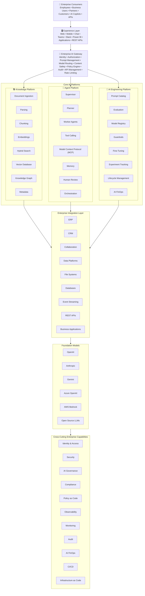

 # Enterprise AI Reference Architecture (EAIRA)

> **Vendor-Neutral • Secure • Governed • Scalable • Production-Ready**

## Architecture Layers

| Layer | Purpose |
|--------|---------|
| Enterprise Consumers | Human users, applications, AI copilots, and APIs |
| Experience Layer | Enterprise user interfaces and API access |
| Enterprise AI Gateway | Central entry point for authentication, routing, governance, and security |
| Knowledge Platform | Enterprise knowledge ingestion, indexing, retrieval, and semantic search |
| Agent Platform | Agent orchestration, planning, memory, tool execution, and collaboration |
| AI Engineering Platform | Prompt management, evaluation, model lifecycle, guardrails, experimentation, and AI FinOps |
| Enterprise Integration Layer | Connects enterprise systems, data platforms, SaaS applications, and APIs |
| Foundation Models | Commercial and open-source AI models |
| Cross-Cutting Enterprise Capabilities | Security, governance, compliance, observability, monitoring, CI/CD, and Infrastructure as Code |